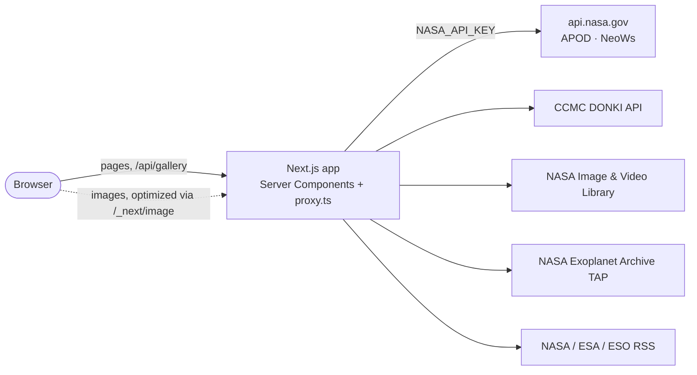
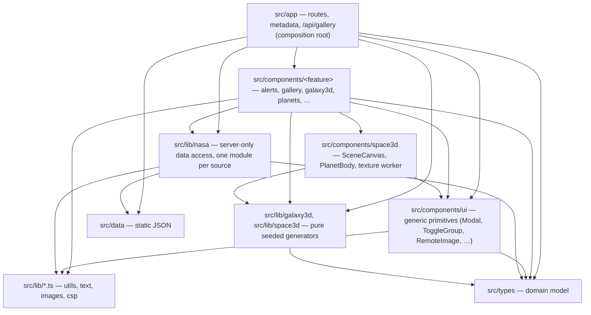

# Architecture

Cosmic Visualizer is a read-only Next.js 16 (App Router) app that renders NASA, ESA and ESO
data, with client-side 3D scenes. It has no database, no auth and no backend service of
its own: the server side is Next itself.

## System context

Every upstream call happens on the server and is cached with `fetch` revalidation
(15 min to 24 h per source). The browser only ever talks to this app.

## Layers

Dependencies point one way only. `npm run check:arch` (dependency-cruiser) fails the build on
any arrow that goes the wrong way, and on any cycle. See
[ADR-0002](../adr/0002-layered-architecture.md).

| Layer                                 | Owns                                                                       | Must not                                                    |
| ------------------------------------- | -------------------------------------------------------------------------- | ----------------------------------------------------------- |
| `src/types`                           | Domain types (`GalleryItem`, `AlertItem`, …) and `NasaApiError`            | import anything from the app                                |
| `src/lib/nasa`                        | Fetch, validate/clamp inputs, normalize upstream JSON/XML into `src/types` | import UI; be imported by Client Components (`server-only`) |
| `src/lib/galaxy3d`, `src/lib/space3d` | Seeded procedural generation returning typed arrays                        | import React, three.js, Next or do I/O                      |
| `src/components/ui`                   | Feature-agnostic primitives                                                | import a feature folder                                     |
| `src/components/<feature>`            | Feature UI; async Server Components may call `lib/nasa`                    | import from `src/app`                                       |
| `src/app`                             | Routes: read params, call `lib/nasa`, compose components                   | contain reusable logic                                      |

## Key flows

**A page render.** A route (Server Component) awaits `searchParams`, calls `src/lib/nasa/*`
(which bounds every input and maps failures to `NasaApiError`), and passes plain data to
components. Each section degrades on its own: one failing source shows an `ErrorState`,
not a broken page.

**A 3D scene.** Pages render a `*Loader` (`dynamic(..., { ssr: false })`), which loads the
scene inside `SceneCanvas` (WebGL fallback + full-window mode). Geometry and textures come
from the pure generators; big textures are generated in `texture.worker.ts`. See
[ADR-0003](../adr/0003-client-only-3d-with-pure-generators.md).

**Security boundary.** `NASA_API_KEY` is read only in `src/lib/nasa/client.ts`, which
imports `server-only`. `src/proxy.ts` sets a per-request nonce CSP. See
[ADR-0001](../adr/0001-server-only-nasa-key.md) and [ADR-0004](../adr/0004-nonce-csp-via-proxy.md).

## Where things live

| Path                   | What                                                                                                                                |
| ---------------------- | ----------------------------------------------------------------------------------------------------------------------------------- |
| `src/app/**/(list)/`   | Route groups that hold `loading.tsx`, so detail pages return a real 404                                                             |
| `src/app/api/gallery/` | The only API route (used by the client-side star modal)                                                                             |
| `src/proxy.ts`         | Next 16 "proxy" (formerly middleware): CSP nonce                                                                                    |
| `tests/`               | `unit`, `component`, `integration`, `performance`, `e2e` — see [quality harness](../solution-plan/quality-harness.md#test-strategy) |
| `visuals/`             | Separate Vite + Three.js prototype with its own toolchain ([ADR-0007](../adr/0007-visuals-standalone-app.md))                       |
