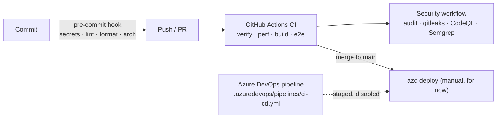

# Delivery

## Path to production



| Stage      | Where                                                                                                                 | Blocking                                      |
| ---------- | --------------------------------------------------------------------------------------------------------------------- | --------------------------------------------- |
| Pre-commit | Developer machine (`.husky/pre-commit`)                                                                               | yes, locally                                  |
| CI         | `.github/workflows/ci.yml` on every PR and push to `main`                                                             | yes (make it a required check)                |
| Security   | `.github/workflows/security.yml` on PRs, `main`, weekly                                                               | audit, gitleaks, CodeQL yes; Semgrep advisory |
| AI review  | `.github/workflows/agent-review.yml` on PRs                                                                           | advisory comment                              |
| Deploy     | `azd deploy` by a maintainer from `main`                                                                              | —                                             |
| Pages      | `.github/workflows/pages.yml`: `visuals/` prototype only ([ADR-0009](../adr/0009-publish-visuals-to-github-pages.md)) | —                                             |
| ADO CI/CD  | `.azuredevops/pipelines/ci-cd.yml`                                                                                    | **not enabled** (`trigger: none`)             |

GitHub CI and the ADO pipeline call the same npm scripts, so there's one definition of "green".
See [ADR-0006](../adr/0006-ci-cd-github-now-ado-staged.md).

## Deploying (interim: azd)

```bash
azd auth login
azd env select <env>         # or `azd env new <env>` the first time
azd env set NASA_API_KEY <key>
azd deploy
```

Deploy only from a `main` commit whose CI run is green. The app needs only one runtime
setting, `NASA_API_KEY` (server-only, optional, falls back to `DEMO_KEY`).

## Enabling the ADO pipeline

1. In Azure DevOps, create a pipeline from `.azuredevops/pipelines/ci-cd.yml`.
2. Create an Azure Resource Manager service connection (workload identity federation).
3. Create a variable group `cosmic-visualizer` with `AZURE_SERVICE_CONNECTION`,
   `AZURE_ENV_NAME`, `AZURE_LOCATION`, `AZURE_SUBSCRIPTION_ID` and `NASA_API_KEY` (secret).
4. Add approvals to the `cosmic-visualizer-prod` environment.
5. Replace `trigger: none` / `pr: none` with branch triggers. If ADO becomes the required
   gate, disable `ci.yml` on GitHub so the two don't drift.

## Open decisions

| Decision                                                                                                                                                            | Blocks                         | Owner      |
| ------------------------------------------------------------------------------------------------------------------------------------------------------------------- | ------------------------------ | ---------- |
| Hosting target (App Service, Container Apps or Static Web Apps hybrid). `azure.yaml` and `infra/` don't exist yet, so `azd deploy` can't run until this is decided. | first deploy, ADO deploy stage | maintainer |
| Whether ADO replaces GitHub Actions or runs alongside it                                                                                                            | turning ADO on                 | maintainer |

Next 16 needs a Node server here: every page renders dynamically because of the CSP nonce
([ADR-0004](../adr/0004-nonce-csp-via-proxy.md)). A static-only host won't work.
