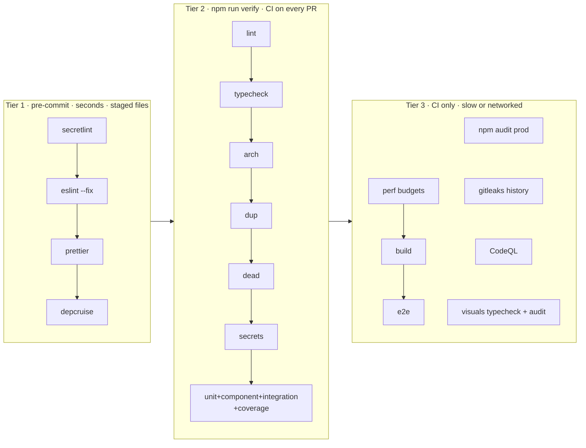
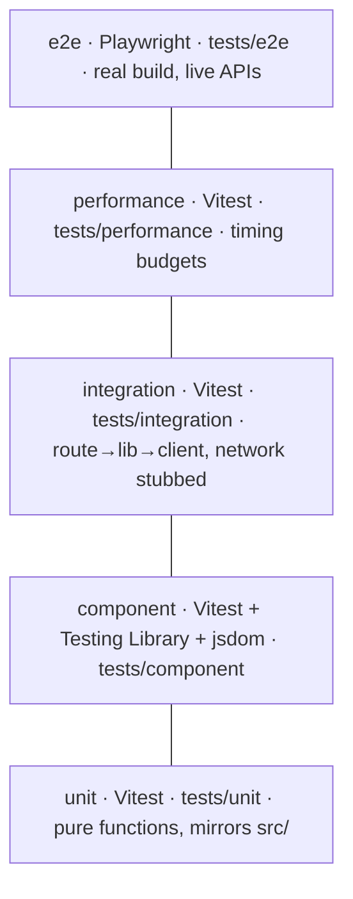

# Quality harness

## The minimum viable harness

Three tiers, each with one entry point. A change goes through **two commands**:
`git commit` (tier 1 runs automatically) and `npm run verify` (tier 2, the same command CI runs).

Then one human/agent step: **review** with `/code-review` in Claude Code (correctness, SOLID, reuse) before opening the PR; the PR workflow adds an advisory AI comment.

**Rule for adding a check:** it must catch a defect class nothing else catches, run in tier 2
in under ~10 s, and have a zero-findings baseline when it lands. Otherwise it doesn't go in.

## What is checked, and by what

Priorities follow the brief: high-priority items are hard failures; low-priority items are
on but cheap.

| Priority | Concern                           | Tool / rule                                                                                                                                                                                                                                                            | Tier       | Notes                                                                                                    |
| -------- | --------------------------------- | ---------------------------------------------------------------------------------------------------------------------------------------------------------------------------------------------------------------------------------------------------------------------- | ---------- | -------------------------------------------------------------------------------------------------------- |
| **High** | Secrets                           | secretlint (staged + tree), gitleaks (full git history)                                                                                                                                                                                                                | 1, 2, 3    | Two engines on purpose: secretlint is npm-only (no binary on dev machines), gitleaks also scans history. |
| **High** | Bad patterns / banned APIs        | ESLint: `eval`/`new Function`, `dangerouslySetInnerHTML`, `innerHTML`/`outerHTML`/`document.write`/`insertAdjacentHTML`, `console.log`, `role="dialog"` outside `ui/Modal`, `React.FC`, `axios`, `process.env` outside `lib/nasa/client.ts`, committed `.only`/`.skip` | 1, 2       | Plus Semgrep (OWASP, React, secrets rulesets; advisory) and CodeQL (dataflow).                           |
| **High** | Dead code, dead models            | knip: unused files, exports, exported types, dependencies                                                                                                                                                                                                              | 2          | Model fields aren't covered; review `src/types` when an upstream field is dropped.                       |
| **High** | Dead logic                        | ESLint core + sonarjs: constant conditions, unreachable code, identical branches/conditions/expressions, dead stores, unused collections                                                                                                                               | 1, 2       |                                                                                                          |
| **High** | Not reusing components            | jscpd (≥50 tokens, threshold 1%), the `ui/Modal` rule above, review checklist                                                                                                                                                                                          | 2          | The `ui/` catalogue is in the [development guide](../guides/development.md#writing-code).                |
| **High** | Circular dependencies             | dependency-cruiser `no-circular`                                                                                                                                                                                                                                       | 1, 2       |                                                                                                          |
| **High** | Forbidden imports (layers)        | dependency-cruiser layer rules; ESLint blocks `@/lib/nasa/*` in Client Components; `server-only` makes it a build error                                                                                                                                                | 1, 2       | Layer map: [architecture](../guides/architecture.md#layers).                                             |
| **High** | Cyclomatic / cognitive complexity | ESLint `complexity` ≤ 12, `sonarjs/cognitive-complexity` ≤ 15, `max-depth` ≤ 4, `max-params` ≤ 5 (6 in numeric generator kernels)                                                                                                                                      | 1, 2       | Raise a limit only on one function, with a comment saying why.                                           |
| **High** | Code duplication                  | jscpd                                                                                                                                                                                                                                                                  | 2          |                                                                                                          |
| **High** | Vulnerable packages               | `npm audit --omit=dev --audit-level=high` for the app and `visuals/` (blocking), Dependabot weekly for both                                                                                                                                                            | 3          | Dev-only advisories are reviewed by hand ([accepted risks](#accepted-risks)).                            |
| **High** | SOLID / Clean Architecture        | dependency-cruiser layer rules (dependency direction), complexity limits (single responsibility), reuse checks; the rest by review against [ADR-0002](../adr/0002-layered-architecture.md)                                                                             | 2 + review | Tools enforce dependency direction; design judgement stays with review.                                  |
| Low      | Lint                              | ESLint (`next/core-web-vitals`, `next/typescript`)                                                                                                                                                                                                                     | 1, 2       |                                                                                                          |
| Low      | Types                             | `tsc --noEmit` (strict)                                                                                                                                                                                                                                                | 2          |                                                                                                          |
| Low      | Formatting                        | Prettier on staged files (`printWidth` 110)                                                                                                                                                                                                                            | 1          | Applied as files are touched; no repo-wide reformat or format gate.                                      |
| Low      | Naming                            | TypeScript/React conventions in `.github/instructions/typescript-react.instructions.md`, review                                                                                                                                                                        | review     | No lint rule: low value for the noise it adds.                                                           |

## Test strategy

| Layer       | Folder                           | Scope                                                                                     | Runs in |
| ----------- | -------------------------------- | ----------------------------------------------------------------------------------------- | ------- |
| Unit        | `tests/unit/**/*.test.ts`        | One module; `fetch` stubbed with `vi.stubGlobal`                                          | verify  |
| Component   | `tests/component/**/*.test.tsx`  | Rendered UI, accessible queries, user events; `next/navigation` mocked                    | verify  |
| Integration | `tests/integration/**/*.test.ts` | Several real modules wired together, only the network stubbed (`/api/gallery`, CSP proxy) | verify  |
| Performance | `tests/performance/**/*.perf.ts` | Generator budgets at 3–5× measured time                                                   | CI      |
| E2E         | `tests/e2e/**/*.spec.ts`         | Production build in Chromium: navigation, 3D canvases, CSP, 404s, mobile menu             | CI      |

Coverage thresholds (statements 90, branches 75, functions 88, lines 90; ratchet up, never down) apply to unit +
component + integration over `src/lib`, `src/app/api`, `src/proxy.ts` and the
jsdom-testable components. WebGL components are covered by e2e instead.

Rules: no `.only`/`.skip` committed (ESLint; Playwright `forbidOnly` in CI); deterministic tests (no live network, wall-clock or
`Math.random` in unit tests); assert behavior, not snapshots.

## Accepted risks

| Item                                                                       | Why accepted                                                                    | Revisit                                  |
| -------------------------------------------------------------------------- | ------------------------------------------------------------------------------- | ---------------------------------------- |
| `braces` advisory (GHSA-vfj7-8cjw-p6xm), dev-only via `eslint-config-next` | No patched version exists; reachable only through lint tooling on trusted input | on the next `eslint-config-next` release |
| Semgrep is advisory                                                        | Its first run on GitHub hasn't been triaged yet                                 | after the first triage, make it blocking |
| secretlint doesn't flag a lone AWS key ID                                  | gitleaks in CI does; secretlint's AWS rule needs the secret too                 | —                                        |
